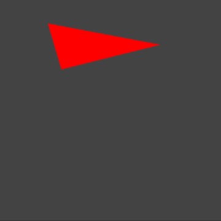
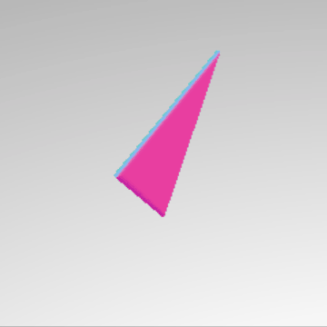

# Extruding from SVG

SVG tags in HTML can be used to manually create images with SVG extension and extruding using three.js

## Attributes

<table>
    <thead>
        <tr>
            <th  style="text-align: center;">Attribute</th>
            <th  style="text-align: center;">Value</th>
            <th  style="text-align: center;">Description</th>
        </tr>
    </thead>
    <tbody>
        <tr>
            <td  style="text-align: center;">width</td>
            <td  style="text-align: center;">length or percentage</td>
            <td  style="text-align: center;">Define the width of the SVG image</td>
        </tr>
        <tr>
            <td  style="text-align: center;">height</td>
            <td  style="text-align: center;">length or percentage</td>
            <td  style="text-align: center;">Define the height of the SVG image</td>
        </tr>
        <tr>
            <td rowspan="3" style="text-align: center;">
                preserveAspectRatio
            </td>
            <td style="text-align: center;">
                xMinYMin,<br/> 
                xMidYMin,<br/> 
                xMaxYMin,<br/> 
                xMinYMid,<br/> 
                xMidYMid,<br/> 
                xMaxYMid,<br/>
                xMinYMax,<br/> 
                xMidYMax,<br/> 
                xMaxYMax
            </td>
            <td  style="text-align: center;">
                Defines how the SVG fragment must be deformed if it is embedded in a container with a different aspect ratio.
            </td>
        </tr>
        <tr>
            <td style="text-align: center;">
                meet (default)
            </td>
            <td  style="text-align: center;">
                Defines how the SVG fragment must be deformed if it is embedded in a container with a different aspect ratio.
            </td>
        </tr>
        <tr>
            <td style="text-align: center;">
                slice
            </td>
            <td  style="text-align: center;">
               	Defines that an image preserves its proportion and the viewBox is scaled down as much as possible.
            </td>
        </tr>
        <tr>
            <td  style="text-align: center;">viewbox</td>
            <td  style="text-align: center;">list-of-numbers</td>
            <td  style="text-align: center;">
                Defines the bound of the SVG viewport for the current SVG fragment.
            </td>
        </tr>
        <tr>
            <td  style="text-align: center;">x</td>
            <td  style="text-align: center;">length or percentage</td>
            <td  style="text-align: center;">
                Determines the x coordinate of the svg container. It has no effect on outermost SVG elements.
            </td>
        </tr>
        <tr>
            <td  style="text-align: center;">y</td>
            <td  style="text-align: center;">length or percentage</td>
            <td  style="text-align: center;">
                Determines the y coordinate of the svg container. It has no effect on outermost SVG elements.
            </td>
        </tr>
    </tbody>
</table>

## Create 3D Geometry

SVG tags in HTML have several ready-to-use shapes. One of them is `<path>`. This shape has an attribute named `d` which is useful for shaping
two-dimensional image based on the coordinates created.

There are several kinds of commands available.

- M = moveto
- L = lineto
- H = horizontal lineto
- V = vertical lineto
- C = curveto
- S = smooth curveto
- Q = quadratic Bezier curve
- T = smooth quadratic Bezier curveto
- A = elliptical arc
- Z = closepath

**Note:** all of the commands above can also be expressed with lower letters. Capital letters means absolutely positioned, lower cases means relatively positioned.

An example would be to make a triangle in 3 dimensions,

1. Create an html file containing the svg tag by using a shape of type path

   ```html
    <!DOCTYPE html>


    <html>

    <head>
        <title>Example 06.05 - Extrude SVG</title>
        <script type="text/javascript" charset="UTF-8" src="../libs/three/three.js"></script>
        <script type="text/javascript" charset="UTF-8" src="../libs/three/controls/TrackballControls.js"></script>
        <script type="text/javascript" charset="UTF-8" src="../libs/other/d3-threeD.js"></script>
        <script type="text/javascript" src="../libs/util/Stats.js"></script>
        <script type="text/javascript" src="../libs/util/dat.gui.js"></script>

        <script type="text/javascript" src="../util.js"></script>
        <script type="text/javascript" src="index-triangle.js"></script>
        <link rel="stylesheet" href="../default.css">

    </head>

    <body>
        <div id="triangle" style="display:none">
            <svg x="0px" y="0px" width="210px"
                height="400px">
                <g>
                    <path id="triangle-path"
                        d="M150 0 L75 200 L225 200 Z"
                    />
                </g>

            </svg>
        </div>

        <div id="webgl-output">
            <script type="text/javascript">
                (function () {
                    init()
                })();
            </script>

    </body>

    </html>
   ```

2. Create javascript file and get attribute `d` using query selector.
   ```js
   var svgString = document.querySelector("#triangle-path").getAttribute("d");
   ```
3. Change `svgString` variable to 3 dimensional with `transformSVGPathExposed()` function
   ```js
   var shape = transformSVGPathExposed(svgString);
   ```
4. Then, use `THREE.ExtrudeGeometry` to create extruded geometry
   ```js
   var geom = new THREE.ExtrudeGeometry(drawShape(), options);
   geom.applyMatrix(new THREE.Matrix4().makeScale(0.05, 0.05, 0.05));
   geom.center();
   ```
5. After that, added attributes in `THREE.ExtrudeGeometry` along with the required GUI. The full source code can be seen [here](https://github.com/cg2021e/threejs-presentation-pencatat-handal/blob/master/A.5.Extruding%20from%20SVG/index-a5.js)

<table>
    <thead>
        <tr>
            <th  style="text-align: center;">Triangle-Shape</th>
            <th  style="text-align: center;">Triangle-ExtrudeGeometry</th>
        </tr>
    </thead>
    <tbody>
        <tr>
            <td  style="text-align: center;">
            
            </td>
            <td  style="text-align: center;"></td>
        </tr>
    </tbody>
</table>
