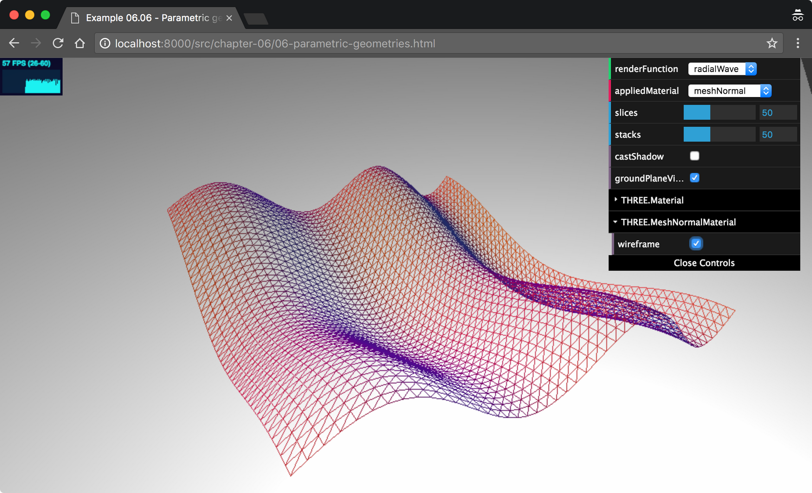
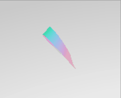
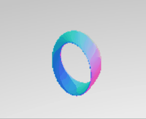

# THREE.ParametricGeometry

With `THREE.ParametricGeometry`, we can create geometries based on equations. The most basic example is the function to create a plane:

```js
plane: function ( width, height ) {
    return function ( u, v, optionalTarget ) {
      var result = optionalTarget || new THREE.Vector3();
      var x = u * width;
      var y = 0;
      var z = v * height;
      return result.set( x, y, z );
    };
  }
```

This function is called by `THREE.ParametricGeometry`. The u and v values will range from 0 to 1 and will be called a large number of times for all the values from 0 to 1. In this example, the u value is used to determine the x coordinate of the vector and the v value is used to determine the z coordinate. When this is run, you'll have a basic plane with a width of width and a depth of depth.

In our example, we do something similar. However, instead of creating a flat plane, we create a wave-like pattern, as you can see in the 06-parametric-geometries.html example. The following screenshot shows this example,



To create this shape, we passed the following function to `THREE.ParametricGeometry`:

```js
radialWave = function (u, v, optionalTarget) {
  var result = optionalTarget || new THREE.Vector3();
  var r = 50;

  var x = Math.sin(u) * r;
  var z = Math.sin(v / 2) * 2 * r;
  var y = (Math.sin(u * 4 * Math.PI) + Math.cos(v * 2 * Math.PI)) * 2.8;

  return result.set(x, y, z);
};

var mesh = createMesh(
  new THREE.ParametricGeometry(radialWave, 120, 120, false)
);
```

As you can see in this example, with a few lines of code, we can create really interesting geometries. In this example, you can also see the arguments we can pass to `THREE.ParametricGeometry`. These are explained in the following table:

<table>
    <thead>
        <tr>
            <th  style="text-align: center;">Property</th>
            <th  style="text-align: center;">Mandatory</th>
            <th  style="text-align: center;">Description</th>
        </tr>
    </thead>
    <tbody>
        <tr>
            <td  style="text-align: center;">
                function
            </td>
            <td  style="text-align: center;">
                Yes
            </td>
            <td>
                This is the function that defines the position of each vertex based on the u and v values provided.
            </td>
        </tr>
        <tr>
            <td  style="text-align: center;">
                slices
            </td>
            <td  style="text-align: center;">
                Yes
            </td>
            <td>
                This defines the number of parts the u value should be divided into.
            </td>
        </tr>
                <tr>
            <td  style="text-align: center;">
                stacks
            </td>
            <td  style="text-align: center;">
                Yes
            </td>
            <td>
                This defines the number of parts the v value should be divided into.
            </td>
        </tr>
    </tbody>
</table>

Here are some of the functions that THREE.ParametricGeometry has,

<table>
    <thead>
        <tr>
            <th  style="text-align: center;">Klein</th>
            <th  style="text-align: center;">Radial Wave</th>
            <th  style="text-align: center;">Mobius</th>
            <th  style="text-align: center;">Mobius 3D</th>
        </tr>
    </thead>
    <tbody>
        <tr>
            <td  style="text-align: center;">
                
            </td>
            <td  style="text-align: center;">
                
            </td>
            <td  style="text-align: center;">
                
            </td>
            <td  style="text-align: center;">
                
            </td>
        </tr>
    </tbody>
</table>

- Klein

  ```js
  klein = function (u, v, optionalTarget) {
    var result = optionalTarget || new THREE.Vector3();

    u *= Math.PI;
    v *= 2 * Math.PI;

    u = u * 2;
    var x, y, z;
    if (u < Math.PI) {
      x =
        3 * Math.cos(u) * (1 + Math.sin(u)) +
        2 * (1 - Math.cos(u) / 2) * Math.cos(u) * Math.cos(v);
      z =
        -8 * Math.sin(u) -
        2 * (1 - Math.cos(u) / 2) * Math.sin(u) * Math.cos(v);
    } else {
      x =
        3 * Math.cos(u) * (1 + Math.sin(u)) +
        2 * (1 - Math.cos(u) / 2) * Math.cos(v + Math.PI);
      z = -8 * Math.sin(u);
    }

    y = -2 * (1 - Math.cos(u) / 2) * Math.sin(v);

    return result.set(x, y, z);
  };
  ```

- Radial Wave

  ```js
  radialWave = function (u, v, optionalTarget) {
    var result = optionalTarget || new THREE.Vector3();
    var r = 50;

    var x = Math.sin(u) * r;
    var z = Math.sin(v / 2) * 2 * r;
    var y = (Math.sin(u * 4 * Math.PI) + Math.cos(v * 2 * Math.PI)) * 2.8;

    return result.set(x, y, z);
  };
  ```

- Mobius

  ```js
  mobius = function (u, t, optionalTarget) {
    var result = optionalTarget || new THREE.Vector3();
    u = u - 0.5;
    var v = 2 * Math.PI * t;

    var x, y, z;

    var a = 2;
    x = Math.cos(v) * (a + u * Math.cos(v / 2));
    y = Math.sin(v) * (a + u * Math.cos(v / 2));
    z = u * Math.sin(v / 2);

    return result.set(x, y, z);
  };
  ```

- Mobius 3D

  ```js
  mobius3d = function (u, t, optionalTarget) {
    var result = optionalTarget || new THREE.Vector3();

    u *= Math.PI;
    t *= 2 * Math.PI;

    u = u * 2;
    var phi = u / 2;
    var major = 2.25,
      a = 0.125,
      b = 0.65;
    var x, y, z;
    x = a * Math.cos(t) * Math.cos(phi) - b * Math.sin(t) * Math.sin(phi);
    z = a * Math.cos(t) * Math.sin(phi) + b * Math.sin(t) * Math.cos(phi);
    y = (major + x) * Math.sin(u);
    x = (major + x) * Math.cos(u);

    return result.set(x, y, z);
  };
  ```
